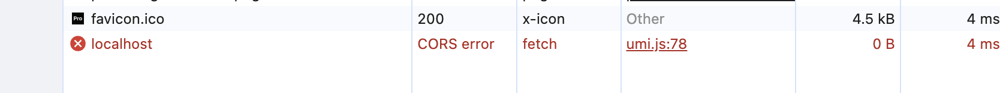
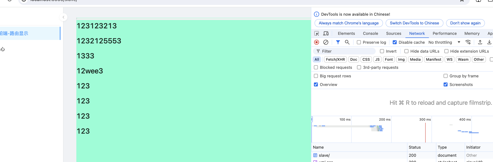

# build-cors

> 解决部署项目时跨域问题

## 项目技术栈
umi4 + qiankun + pnpm + monorepo + antd +react 

## 项目结构
- master 主应用
- slaver 子应用
- .env指定 主应用的port默认为5000 子应用的port默认为5555

## 复现步骤

1.打包

```bash
pnpm run build
```

2.修改nginx

```ngnix
...
server {
        listen       8080;
        server_name  localhost;

        location / {
            root   打包生成 绝对路径+/dist;
            index  index.html index.htm;
            try_files $uri $uri/ /index.html;
        }
    }

    server {
        listen       5555;
        server_name  localhost;

        location / {
            root   打包生成 绝对路径+/dist;
            index  index.html index.htm;
            try_files $uri $uri/ /index.html;
        }
    }

```

3.重启nginx

```bash
nginx -s reload
```

4.输入localhost:8080验证部署成功 -> 之后切换到子应用 出现cors



5.修改nginx增加跨域

```nginx
 server {
        listen       5555;
        server_name  localhost;

        location / {
            add_header Access-Control-Allow-Origin '*';
            add_header 'Access-Control-Allow-Methods' 'GET, POST, OPTIONS';
            add_header 'Access-Control-Allow-Headers' 'Pragma,Expires,Authorization,Cache-Control,Content-Type';
						...
        }
    }

```

6.重启nginx

```shell
nginx -s reload
```

正常访问

