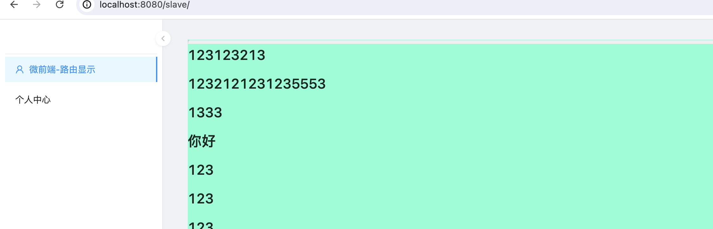
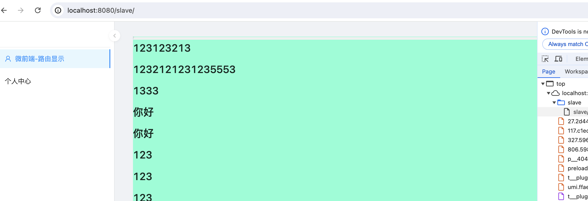
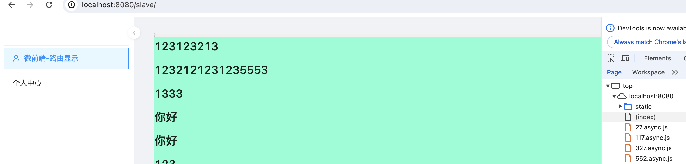

# clean-cache-demo

> 解决应用更新浏览器刷新还是旧内容的问题

## 项目技术栈

umi4 + qiankun + pnpm + monorepo + antd +react 

## 项目结构

- Demo1 使用hash:true
- Demo2 ngnix中的子应用加入 add_header Cache-Control "no-store"*;*
- Demo3 拦截子应用静态资源请求设置no-store
- Demo4 在主应用的app.js加入 no-store
```js
// umi-plugin-qiankun 
  fetch: (url, options) => { //用于拦截 htmlEntry 静态资源 fetch 时的请求s
    // 使用 window.fetch 发起请求
    return window.fetch(url, {...options, cache: 'no-cache'});
  },
```

## 项目执行步骤

### Demo1 

>  参考 https://umijs.org/docs/api/config#hash

1.修改子应用和主应用的config/config.ts

```js
...
hash:true
....
```

2.打包

```bash
pnpm run build1
```

3.修改nginx

```ngnix
...
server {
        listen       8080;
        server_name  localhost;

        location / {
            root   打包生成 绝对路径+/dist;
            index  index.html index.htm;
            try_files $uri $uri/ /index.html;
        }
    }

    server {
        listen       5555;
        server_name  localhost;

        location / {
            root   打包生成 绝对路径+/dist;
            index  index.html index.htm;
            try_files $uri $uri/ /index.html;
        }
    }

```

3.重启nginx

```bash
nginx -s reload
```

4、http://localhost:8080/slave/



5、修改slaver/src/pages/home/index.jsx 中的任意h1标签

6、打包, 之后在对应dist/xxxhome__index.xxx.js文件查看

```bash
pnpm run build1
```

7、刷新子应用http://localhost:8080/slave/



### Demo2

1、打包

```bash
pnpm run build2
```

2.修改nginx

```ngnix
...
server {
        listen       8080;
        server_name  localhost;

        location / {
            root   打包生成 绝对路径+/dist;
            index  index.html index.htm;
            try_files $uri $uri/ /index.html;
        }
    }

    server {
        listen       5555;
        server_name  localhost;

        location / {
            root   打包生成 绝对路径+/dist;
            index  index.html index.htm;
            try_files $uri $uri/ /index.html;
        }
    }

```

3.重启nginx

```bash
nginx -s reload
```

4、http://localhost:8080/slave/



5、修改slaver/src/pages/home/index.jsx 中的任意h1标签

6、打包, 之后在对应dist/xxxhome__index.xxx.js文件查看

```bash
pnpm run build2
```

7、修改nginx

```ngnix
...
    server {
        listen       5555;
        server_name  localhost;

        location / {
        		add_header Cache-Control no-store;
            ...
        }
    }

```

8.重启nginx

```bash
nginx -s reload
```

9、http://localhost:8080/slave/

